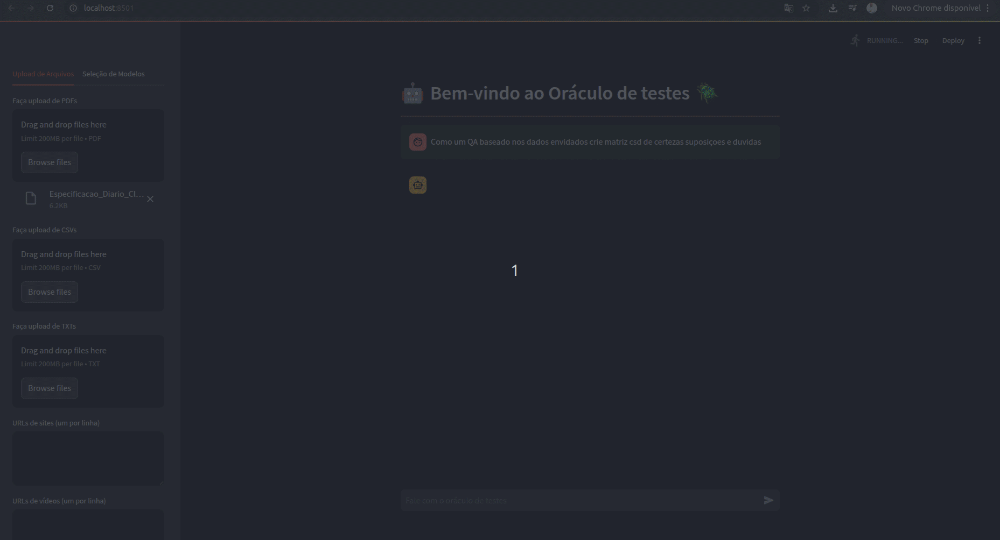

# 🧪 Oráculo de Testes -- Aplicação em Python com Streamlit + LangChain



Este repositório contém uma aplicação em **Python**, construída com
**Streamlit** e **LangChain**, que funciona como um **oráculo de
testes**.\
A ideia é simples e poderosa: você envia **arquivos** (PDFs, documentos,
textos, etc.) e **vídeos**, e o sistema utiliza esses materiais como
base de conhecimento para responder perguntas e apoiar análises no
contexto de **qualidade de software**, **testes** e **validação**.

------------------------------------------------------------------------

## 🚀 Funcionalidades

-   📂 **Upload de arquivos** como fonte de conhecimento\
-   🎥 **Suporte a vídeos** como base de dados\
-   🤖 **Processamento com LangChain** para criação de memória e
    contextualização\
-   🧠 **Consultas inteligentes** sobre o conteúdo enviado\
-   🌐 Interface simples com **Streamlit**

------------------------------------------------------------------------

## 📦 Tecnologias Utilizadas

-   **Python 3.10+**
-   **Streamlit**
-   **LangChain**
-   **Modelos LLM** (OpenAI, Groq, etc.)
-   Ferramentas auxiliares de leitura e extração de arquivos/vídeos

------------------------------------------------------------------------

## ▶️ Como executar o projeto localmente

### 1. Clone o repositório

``` bash
git clone https://github.com/SEU-USUARIO/seu-repo.git
cd seu-repo
```

### 2. Ative o ambiente virtual

``` bash
source venv/bin/activate
```

### 3. Instale as dependências

``` bash
pip install -r requirements.txt
```

### 4. Execute a aplicação

``` bash
streamlit run app.py
```

O Streamlit irá iniciar um servidor local (geralmente em
http://localhost:8501).

------------------------------------------------------------------------

## 📁 Estrutura básica do projeto

    /
    ├── app.py                # Aplicação principal
    ├── loaders/              # Carregadores de arquivos e vídeos
    ├── imagem.gif            # GIF de demonstração incluído no README
    ├── venv/                 # Ambiente virtual
    ├── requirements.txt      # Dependências
    └── README.md

------------------------------------------------------------------------

## 💡 Sobre o Oráculo de Testes

No contexto do ISTQB, um **oráculo de testes** é uma fonte confiável
para verificar se o comportamento observado está correto.\
Neste projeto, o oráculo é alimentado dinamicamente com seus
**arquivos** e **vídeos**, permitindo que a IA responda perguntas
contextualizadas --- ideal para:

-   Revisão de requisitos\
-   Análise de cenários de teste\
-   Apoio ao QA\
-   Estudos e pesquisa

------------------------------------------------------------------------

## 🤝 Contribuições

Pull requests são super bem-vindos! Sugestões e relatórios de bugs
também.

------------------------------------------------------------------------

## 📜 Licença

Escolha a licença desejada (ex.: MIT, Apache 2.0).
